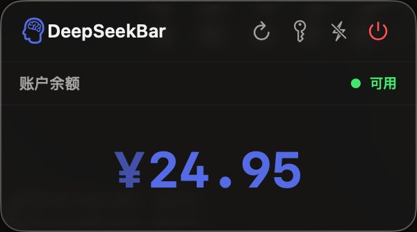
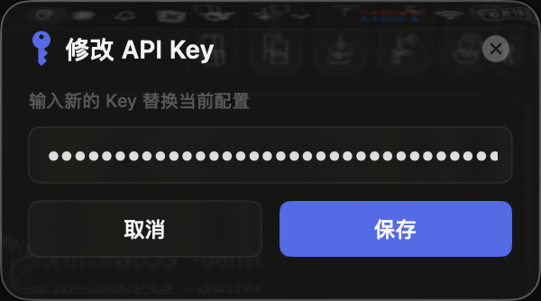

# DeepSeekBar

macOS 菜单栏应用，用于快速查看 DeepSeek 账户余额。

## 截图

| 主面板 | 编辑 API Key |
|---|---|
|  |  |

> 截图待补充

## 功能

- **菜单栏余额展示**：打开菜单栏下拉面板，立即显示 DeepSeek 账户总余额。
- **自动刷新**：每次打开菜单自动从 DeepSeek API 获取最新余额数据。
- **状态指示灯**：绿色 `● 可用` / 红色 `● 不可用`，一目了然。
- **液态玻璃 UI**：使用 SwiftUI 原生 Material（`.ultraThinMaterial` / `.thinMaterial`），完美融入 macOS 毛玻璃设计语言。
- **品牌配色**：余额数字使用 DeepSeek 品牌蓝色，大号字体突出显示。
- **API Key 管理**：首次启动弹出配置界面，随时可修改 Key。

## 安装

### 从源码构建

环境要求：

- macOS 26.5+
- Xcode 26.5+

```bash
git clone https://github.com/your-username/DeepSeekBar.git
cd DeepSeekBar
open DeepSeekBar.xcodeproj
```

在 Xcode 中选择目标 `DeepSeekBar`，按 `⌘R` 构建并运行。

## 使用

1. 运行应用后，菜单栏会出现 🧠 图标。
2. **首次启动**：弹出 API Key 配置界面，输入你的 DeepSeek API Key。
3. **查看余额**：点击菜单栏图标打开下拉面板，显示总余额和账户状态。
4. **刷新数据**：点击 🔄 按钮手动刷新，或直接关闭菜单再打开自动触发刷新。
5. **修改 Key**：点击 🔑 按钮打开编辑面板，支持取消返回。
6. **退出应用**：点击 ⏻ 按钮。

## 数据

- **API Key**：保存在 `UserDefaults`，key 为 `api_key`。
- **余额数据**：通过 DeepSeek 官方 API `GET /user/balance` 获取，仅保留在内存中，关闭菜单后释放。

不包含分析、遥测或第三方追踪。

## 技术栈

- Swift 5.0+
- SwiftUI（`MenuBarExtra` + `.menuBarExtraStyle(.window)`）
- Foundation URLSession（async/await）
- `NSVisualEffectView` Material（`.ultraThinMaterial` / `.thinMaterial`）
- UserDefaults

## 项目结构

```
DeepSeekBar/
├── DeepSeekBarApp.swift      # 应用入口，MenuBarExtra
├── ContentView.swift         # 主面板 UI（余额 + 状态）
├── APIKeySetupView.swift     # API Key 配置/编辑界面
├── DeepSeekAPIService.swift  # 网络请求（fetchBalance）
├── Models.swift              # 数据模型（BalanceResponse）
├── DeepSeekBar.entitlements  # 沙箱授权（网络 + 文件）
└── Assets.xcassets/          # 应用图标、配色
```

## 许可证

MIT
